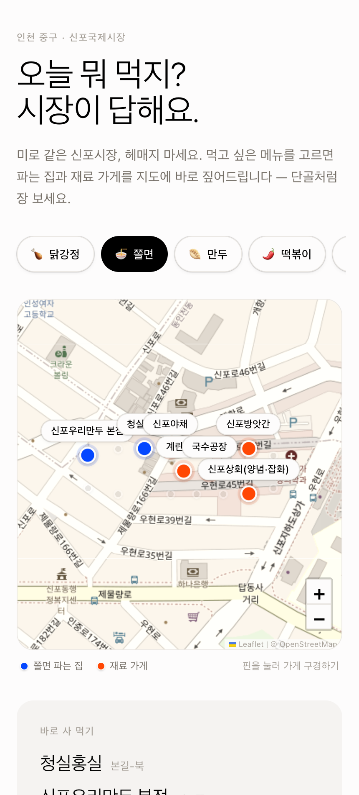
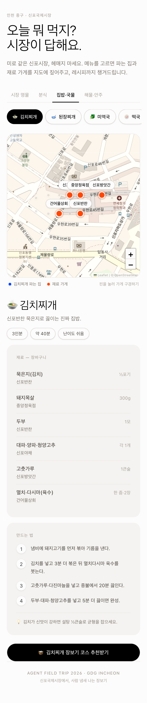

# 신포 장보기 지도

### 오늘 뭐 먹지? 시장이 답해요.

미로 같은 **인천 신포국제시장**에서, 먹고 싶은 메뉴를 기준으로 **바로 사 먹을 집과 재료를 살 가게**를 함께 찾아보는 모바일 중심 프로토타입입니다. 메뉴를 고르면 지도와 재료 분량, 만드는 법이 한 화면에서 이어집니다.

**[서비스 열기](https://agent-field-trip-incheon.vercel.app)** · **[쫄면으로 둘러보기](https://agent-field-trip-incheon.vercel.app/?menu=jjolmyeon)** · **[김치찌개 레시피](https://agent-field-trip-incheon.vercel.app/?menu=kimchijjigae)**

> GDG Incheon Agent Field Trip · 2026.09.12
>
> “인천의 현장에서 발견한 장소 경험 하나를 Agent와 함께 작동하는 서비스로.”

## 화면으로 보기

<table>
  <tr>
    <td align="center"><strong>크림색 지도 디자인 · 쫄면</strong></td>
    <td align="center"><strong>현재 레시피 화면 · 김치찌개</strong></td>
  </tr>
  <tr>
    <td valign="top"></td>
    <td valign="top"></td>
  </tr>
</table>

**디자인 기준:** 저장소에서 확인한 시각 자료는 위 구현 캡처입니다. `07`은 크림색 에디토리얼 스타일, `08`은 그 스타일에 카테고리와 레시피를 더한 최신 화면입니다. 별도 Figma/목업 원본은 현재 파일·원격 브랜치·PR·이슈에서 찾지 못했습니다. 따라서 별도 목업을 추측하지 않고 이 캡처와 실제 코드를 기준으로 설명합니다. 과거 `01`–`06`에는 이전 SVG 약도와 어두운 디자인이 포함되어 있습니다.

밝은 종이색 배경, 가벼운 큰 제목, 따뜻한 회색 카드, 검정 메뉴 버튼을 사용합니다. **파랑은 선택한 메뉴 판매점, 주황은 재료 가게**입니다. 지도 이미지: © [OpenStreetMap contributors](https://www.openstreetmap.org/copyright).

## 홍보 영상

**[홍보 MP4 보기 / 다운로드](evidence/recordings/sinpo-market-promo.mp4)** · [스토리보드·자산 출처·재현 방법](docs/PROMO.md)

기존 프로젝트 화면을 사용한 한국어 자막 중심의 무음 홍보 영상입니다. 제품 소개용 화면 편집이며, 실제 보행 안내나 AI 응답 성공을 녹화한 영상은 아닙니다.

## 어떤 경험인가요?

1. **메뉴 선택** — 시장 명물 / 분식 / 집밥·국물 / 해물·안주 중 오늘 먹고 싶은 메뉴를 고릅니다.
2. **사 먹기 또는 만들어 먹기** — 등록된 완제품 판매점과 재료별 가게를 지도에서 함께 확인합니다. 완제품 판매점이 등록되지 않은 메뉴는 재료 중심으로 보여줍니다.
3. **핀과 가게 이름 누르기** — 가게명, 구역, 등록 품목을 확인합니다.
4. **레시피 확인** — 인분, 예상 조리 시간, 난이도, 재료 분량, 순서와 일부 메뉴의 팁을 읽습니다.
5. **선택 기능: AI 장보기 코스** — 제공자 키가 설정된 환경에서만 텍스트 코스 추천을 요청합니다.

## 구현된 것과 데모의 한계

기준 소스: [`app/page.tsx`](app/page.tsx), [`app/MarketMap.tsx`](app/MarketMap.tsx), [`lib/market.ts`](lib/market.ts).

| 항목 | 현재 상태 |
| --- | --- |
| 메뉴·레시피 | **구현됨.** 4개 카테고리, 16개 메뉴. 레시피는 정적 데이터이며 AI 실시간 생성이 아닙니다. |
| 메뉴 → 판매점·재료 가게 | **구현됨.** 18개 등록 가게와 메뉴별 연결 데이터. 가게 존재·판매 품목·레시피 완전성은 별도 현장 검증이 필요합니다. |
| 지도와 핀 | **구현됨.** Leaflet + OpenStreetMap 타일, 확대/축소, 선택 강조, 가게 상세. **가게 좌표는 약도 좌표를 위·경도로 선형 환산한 근사값**으로, 실측 GPS 위치가 아닙니다. |
| 메뉴 링크 | **구현됨.** `/?menu=jjolmyeon` 등으로 진입하면 메뉴와 해당 카테고리를 선택합니다. 메뉴 선택 시 주소를 자동 갱신하는 공유 버튼은 없습니다. |
| AI 장보기 코스 | **연동 코드 구현, 성공 동작 미검증.** `/api/agent`와 버튼이 있습니다. 키·사용 가능 모델·쿼터가 필요합니다. x좌표 순 방문을 프롬프트로 요청하는 텍스트 추천이지 최단 경로 계산이나 지도 경로선이 아닙니다. |
| 실시간 재고·가격·영업시간 | **미구현.** 점포 실시간 데이터 연동이 없습니다. |
| 현재 위치·내비게이션·오프라인 지도 | **미구현.** 사용자 GPS 추적·도보 경로 안내·오프라인 타일 저장은 없습니다. 지도 타일은 인터넷 연결이 필요합니다. |
| 장바구니 결제·주문 | **미구현.** “재료 — 장바구니”는 재료 목록 제목이며 담기·결제 기능이 아닙니다. |

**시안만 보고 기능을 보장하지 않습니다.** 최신 캡처의 메뉴·지도·레시피 UI는 코드에 구현돼 있지만, 상점 위치와 품목은 검증된 상업용 길안내 데이터가 아닙니다. 방문 전 가게와 판매 여부를 직접 확인해 주세요.

## 로컬 실행 — AI 키 없이 먼저 둘러보기

Node.js 20.9 이상과 npm을 준비합니다. 잠금 파일 기준 Next.js 16 프로젝트입니다.

```bash
git clone https://github.com/hanshin-lee/agent-field-trip-incheon.git
cd agent-field-trip-incheon
npm ci
npm run dev
# http://localhost:3000
# http://localhost:3000/?menu=kimchijjigae
```

메뉴·레시피·가게 데이터는 키 없이 동작합니다. 현재 지도는 공개 OSM 타일을 사용하므로 `NEXT_PUBLIC_MAP_KEY`가 필요하지 않습니다. 공개 타일 사용 시 [OpenStreetMap 타일 사용 정책](https://operations.osmfoundation.org/policies/tiles/)을 따라야 합니다.

### 선택: AI 제공자 설정

```bash
cp .env.example .env.local
# .env.local에서 AGENT_PROVIDER와 해당 제공자 설정을 입력하세요.
# 설정 변경 후 개발 서버를 다시 시작하세요.
```

| `AGENT_PROVIDER` | 필요한 환경 변수 |
| --- | --- |
| `google` (기본값) | `GOOGLE_GENERATIVE_AI_API_KEY` |
| `openai` | `OPENAI_API_KEY` |
| `anthropic` | `ANTHROPIC_API_KEY` |
| `runyour` | `RUNYOUR_API_KEY`, `RUNYOUR_BASE_URL` |

[`lib/providers.ts`](lib/providers.ts)의 모델 ID와 계정 권한을 확인하세요. Runyour 연결부는 일반 `fetch` 기반 연결 코드이므로 실제 서비스 요청·응답 규격과 맞는지 추가 확인이 필요합니다. `.env.local`과 키는 커밋하지 마세요.

- `GET /api/health`: 선택된 제공자와 **키가 비어 있지 않은 제공자 목록**을 반환합니다. 키의 유효성·쿼터·실제 API 연결을 검사하지는 않습니다. `available: []`여도 지도·레시피는 사용할 수 있습니다.
- `POST /api/agent`: `{ "prompt": "...", "provider": "google" }` → `{ provider, text }`. 빈 프롬프트는 400, 처리 실패는 500과 오류 메시지를 반환합니다. 실제 요청에는 제공자 사용료가 발생할 수 있습니다.
- **2026-09-12 확인:** 공개 홈 HTTP 200, 공개 `/api/health`는 `active: "google"`, `available: []`. 유료 AI 요청은 수행하지 않았습니다. 상태는 이후 배포 설정에 따라 달라질 수 있습니다.

## 검증과 구조

```bash
npm run build
npx tsc --noEmit
```

2026-09-12 검증에서 빌드는 통과했지만, **타입 검사는 기존 `next.config.ts:7`의 `eslint` 속성으로 TS2353 오류가 발생했습니다.** 현재 설정은 빌드 중 TypeScript 오류를 무시하므로 **빌드 성공만으로 타입 검증을 대신할 수 없습니다.** [검증 기록](docs/VERIFICATION.md)에 성공 항목과 남은 문제를 구분했습니다. `npm run lint`는 기존 `next lint` 스크립트로, Next.js 16에서 사용할 수 없으므로 검증 완료 항목으로 취급하지 않습니다.

```text
app/page.tsx                 카테고리·메뉴·가게 상세·레시피·AI 요청 UI
app/MarketMap.tsx            Leaflet 지도와 핀
app/api/agent/route.ts       선택형 AI 텍스트 생성 API
app/api/health/route.ts      제공자 설정 존재 여부
lib/market.ts               18개 가게·16개 메뉴·레시피·근사 좌표
lib/providers.ts            AI 제공자 전환
scripts/promo-render.py     홍보 영상 재현
evidence/                   현장 메모·화면·영상
docs/PROMO.md               영상 스토리보드·재현·출처
HANDOFF.md                  진행 상태와 다음 작업
```

스택: **Next.js 16 · React 19 · TypeScript · Tailwind CSS v4 · Leaflet · Vercel AI SDK**. 공개 데모는 Vercel 주소에서 제공됩니다.

## 현장 발견과 Agent 협업 기록

처음 온 사람에게 시장은 미로입니다. “쫄면을 만들려면 사리와 야채를 어디서 사지?”라는 질문에서 메뉴 중심 지도가 출발했습니다. [현장 관찰 메모](evidence/field-notes/sinpo-observation.md)는 이 문제를 기록합니다. 화면 캡처는 구현 증거이며 현장 사진을 대신하지 않습니다.

Agent에게 데이터 매핑, 지도·레시피 UI, 제공자 연결, 검증·배포, README 정리와 홍보 영상 제작을 위임했습니다. 현재 상태는 [HANDOFF.md](HANDOFF.md), 행사 기준은 [docs/EVENT.md](docs/EVENT.md), 팀 인수인계 방식은 [docs/TOKEN-RELAY.md](docs/TOKEN-RELAY.md)를 참고하세요.

`npm run pickup`은 pull을, `npm run handoff`는 변경 파일의 커밋·푸시를 수행하는 팀용 도구입니다. 로컬 수정과 현재 브랜치를 확인하고 사용하세요. 이 README·영상 작업은 별도 브랜치에서 진행하며 main에 자동 병합하지 않습니다.
